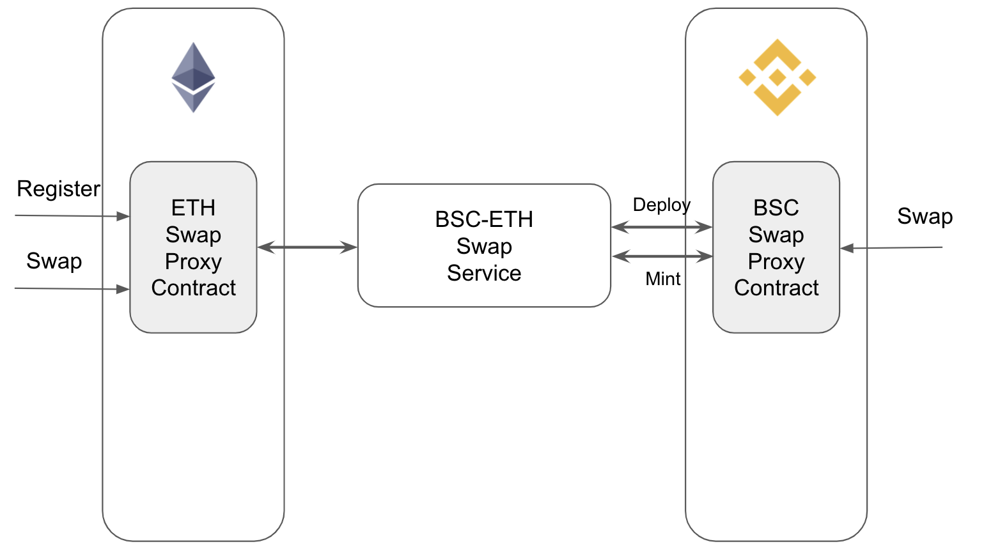
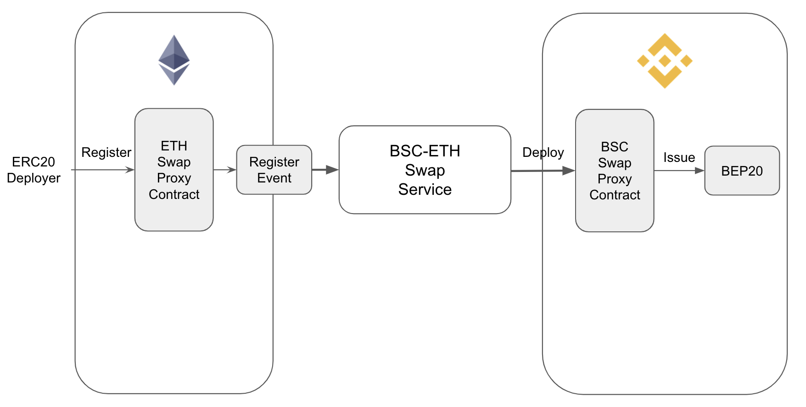
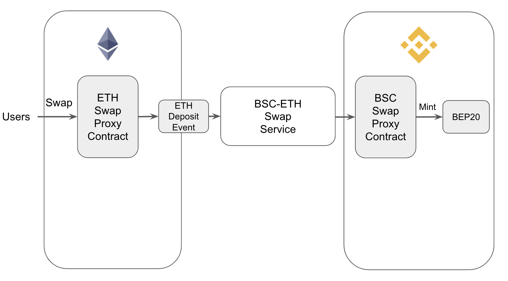
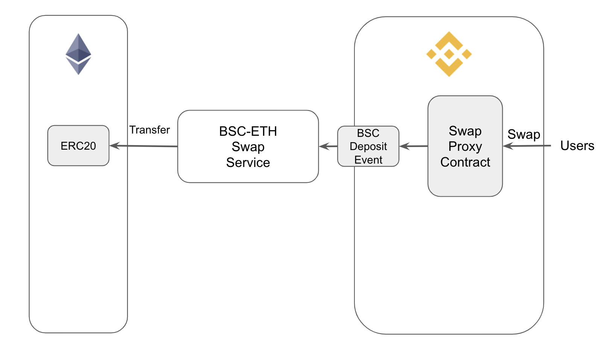

# Side-Main Swap Service

## Motivation

To enable the value flow between Side and Ethereum, especially for the token not listed on .com, we introduce a swap service as a bridge between Ethereum and Side. It should implement that:
1. Value flow between Side and Ethereum bi-directionally.
2. The tokens can be initially created on Ethereum, then register the ERC20 token to Main swap proxy contract. Then a BEP20 token will be deployed on Side by the Side-Main swap service.

## How It Works?

### Architecture

The Binance Chain team will deploy two swap contracts on both Main and Side, then maintain a Side-Main swap service to handle token registrations and swap requests. To list an ERC20 token in this swap system, anyone can call the register method on Main and the swap service will do some checks on it. Once all checks are passed, a [canonical BEP20 token](https://github.com/binance-chain/canonical-upgradeable-bep20/blob/master/contracts/BEP20TokenImplementation.sol) (zero initial supply) will be deployed. The name of the BEP20 token will append a postfix: “ mirrored from Main”. Then users can swap their token bi-directionally.

### Register

1. Anyone can call the register method to register a ERC20 and an event will be emitted.
2. Side-Main-Swap service will do some checks about the event.
    1. The register transaction should be from the ERC20 deployer. If not, the register will be ignored.
    2. The swap service will ensure the contract is a valid ERC20 token.
    3. If an ERC20 is already registered, all other registrations transactions on it will fail.
4. If all checks are passed, the Side-Main-Swap service will call Side swap proxy contract to issue an BEP20 contract. The initial supply is zero and the swap proxy contract has the authority to mint the BEP20 token.

### Swap From Main To Side

1. Users call the swap method to deposit ERC20 to the swap service’s Main account.  Zero swap fee will be charged.Then a deposit event will be emitted.
2. Side-Main-Swap service will monitor deposit events on Main and do some checks.
3. If all checks are passed, the swap service will send a transaction to mint BEP20 token to the swap requester.

### Swap From Side To Main

1. Users call the swap method to deposit BEP20 to the Side swap contract. Users need to pay BNB as the swap fee. The deposited token will be burned immediately and emit an deposit event.
2. Side-Main-Swap service will monitor deposit events on Side and do some checks.
3. If all checks are passed, the swap service will send a transaction to transfer the ERC20 token to the swap requester.
4. The Side account has the authority to change the swap fee.

